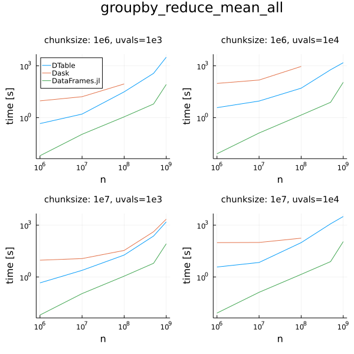

# What is the DTable?

The `DTable` is a table structure providing partitioning of the data and parallelization of operations performed on it in any environment.
It's built on top of `Dagger`, which enables it to work in any worker and thread setup by taking care of task scheduling and memory management.
Any `Tables.jl` compatible source can be ingested by the `DTable` and it can also act as one in case you move the data somewhere else.

An important fact is that the `DTable` doesn't use any dedicated structure for storing the data in memory.
Any `Tables.jl` compatible table type can be used for internal storage, which allows for greater composability with the ecosystem.
To further support that the set of operations that can be performed on a `DTable` is generic and only relies on interfaces offered by `Tables.jl`.

# Why the DTable?

The end goal of the `DTable` is to be the go to solution for out-of-core tabular data processing in Julia and to be competetive with similiar tools such as `Dask` or `Spark`.
Leveraging the composability of the Julia data ecosystem we can reuse a lot of existing functionality in order to achieve that and continue improving the solution.
A good example of that is the already mentioned out-of-core processing capability, which will be enabled in the future through the introduction of memory awareness and caching to disk in `Dagger`.

# What can you do with the DTable today?

- map
- filter
- reduce
- Tables.jl input/output
- groupby (shuffle with full data movement)
- grouped reductions

# How does it compare to competition

The benchmarks present the initial performance assessment of the `DTable`
It's compared against `Dask`, which is the main competitor here.
The `DataFrames` measurements are there to provide a good reference to what the performance in Julia looks like today.

Please beware that this is an early stage of development of the `DTable` and performance/memory utilization were not yet a major focus of the project.
The goal here is to see where we're at right now.

Also please beware that some benchmarks needed adjustment in some ways in order to ensure the benchmark was actually measuring the same type of activity in all technologies used. Details will be noted under each benchmark.

|                         type | avg*times*faster*than*dask | avg*times*faster*than*dataframes |
| ----------------------------:| --------------------------:| --------------------------------:|
|                 $filterhalf$ |                    $0.887$ |                          $2.749$ |
|       $groupbyreducemeanall$ |                   $11.832$ |                          $0.028$ |
|           $groupbysinglecol$ |                   $18.001$ |                          $0.002$ |
|   $groupedreducemeanallcols$ |                   $21.727$ |                           $0.93$ |
| $groupedreducemeansinglecol$ |                    $19.41$ |                          $0.399$ |
|               $incrementmap$ |                    $5.057$ |                          $0.497$ |
|               $reducevarall$ |                   $27.123$ |                          $3.745$ |
|            $reducevarsingle$ |                   $31.126$ |                          $2.942$ |

# Configs

machine 1
Ryzen 5800X 8c/16t
32 GB RAM
worker setup: 1
thread setup: 16

data setup:
Table with 4 columns of random Int32 type
Table of n rows
Int32 values either 0:999 or 0:9999

Chunksize = partition size
either 1e6 or 1e7 (16MB or 160MB)

# Basic operations

*description*

note: DataFrames.jl uses OnlineStats instead of Statistics to make the benchmark fair. The goal is to show that parallelization in the `DTable` works as expected (makes the thing go faster).

no impact on the performance when it comes to unique values count, including fewer plots

plots still todo, just fyi for now

### reduce_var_single

`reduce(fit!, d, cols=[:a1], init=Variance())`

### reduce_var_all

`reduce(fit!, d, init=Variance())`

### increment_map

`map(row -> (r = row.a1 + 1,), d)`

### filter_half

`filter(row -> row.a1 < unique_values ÷ 2, d)`

# Shuffle

As shuffle is one of the heaviest ops in distributed table computing it was one of the first ones tackled.

Here we're testing a full shuffle on `un` unique values.
That will result in creation of a new table with each partition having only rows belonging to the certain key

`g = Dagger.groupby(d, :a1)`

Note: Dask is using shuffle explicitly here due to the fact that usage of groupby in Dask doesn't always result in shuffling, we just want to see the shuffle performance here 

- groupby_single_col

# Shuffle reductions

Note2: Both Dagger and Dask are using OnlineStats reductions for a fair comparison of a typical reductor

Note: Dask is using shuffle explicitly here due to the fact that usage of groupby in Dask doesn't always result in shuffling, we just want to see the shuffle performance here 

## groupby + reduce

### groupby_reduce_mean_all

this one is kinda bad, doesn't really show anything interesting, just a combination

dtable is faster though and at least finished in more cases

## just reduce

### grouped_reduce_mean_singlecol

### grouped_reduce_mean_allcols

# Implementation details

stuff

# Roadmap

link to the DTable todo

some mention that some things will be available within ~6 months

# How can I use it?

custom Julia branch for now (not even master), but we're trying to put everything necessary into julia 1.7

Dagger ~ newest/master
