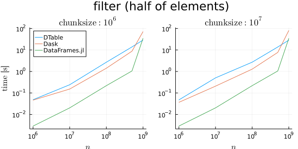

@def rss_pubdate = Date(2021, 11, 02)
@def rss = """TODO: DTable: distributed table implementation"""
@def published = "02 November 2021"
@def title = "TODO: DTable: distributed table implementation"
@def authors = """TODO""" 

TODO: intro

\toc

# What is the `DTable`?

The `DTable` is a table structure providing partitioning of the data and parallelization of operations performed on it in any environment.
It's built on top of `Dagger`, which enables it to work in any worker and thread setup by taking care of task scheduling and memory management.
Any `Tables.jl` compatible source can be ingested by the `DTable` and it can also act as one in case you move the data somewhere else.

An important fact is that the `DTable` doesn't use any dedicated structure for storing the data in memory.
Any `Tables.jl` compatible table type can be used for internal storage, which allows for greater composability with the ecosystem.
To further support that the set of operations that can be performed on a `DTable` is generic and only relies on interfaces offered by `Tables.jl`.

The diagram below presents a simple visual explaination of how the `DTable` and `GDTable` (grouped `DTable`) are built.
The input will be partitioned according to either a `chunksize` provided by the user or the existing partitioning (using the `Tables.partitions` interface).
After performing a `groupby` operation the data will be shuffled accordingly and new chunks containing only the data belonging to specific keys will be created.
Along with an `index` these chunks form a `GDTable`.

# Why the DTable?

The `DTable` aims to excel in two areas:

- parallelization of data processing
- out-of-core processing (will be available through future `Dagger.jl` upgrades)

The goal is to become competetive with similiar tools such as `Dask` or `Spark`, so that Julia users can solve and scale their problems without the need to use a different programming language.

By leveraging the composability of the Julia data ecosystem we can reuse a lot of existing functionality in order to achieve the above goals and continue improving the solution in the future instead of just creating another classic monolithic solution.

## Operations available today

Below is a list of functionality generally available today.
To post suggestions please comment under this issue https://github.com/JuliaParallel/Dagger.jl/issues/273 .

TODO fix the link

- `map`
- `filter`
- `reduce`
- `groupby` (shuffle with full data movement)
- grouped `reduce`
- constructors consuming `Tables.jl` compatible input
- compatibility with `Tables.jl` (`DTable` can be used as a source)

# Initial performance comparison (multithreaded)

The benchmarks below present the initial performance assessment of the `DTable` compared to `DataFrames.jl`, which is the go-to data processing package in Julia and to `Dask`, which is the main competitor to the `DTable`.
The `DataFrames.jl` benchmarks are there to provide a reference to what the performance in Julia looks like today.

Please note that the benchmarks below were specifically prepared with the focus on comparing the same type of processing activities, so benchmark commands were accordingly adjusted to make sure the packages are doing exactly the same thing under the hood.

The table below presents the summary of the results obtained in a one machine multithreaded environment (exact setup in the next section).
Times from every configuration of each benchmark were compared and summarized in the table.
Values above `1.0` mean the `DTable` was this many times faster than the competing package.
Values below `1.0` mean that the `DTable` was slower in that benchmark.

|                    Operation     | times faster than Dask     | times faster than DataFrames.jl  |
| --------------------------------:| --------------------------:| --------------------------------:|
|                          Map     |                    $5.057$ |                          $0.497$ |
|                       Filter     |                    $0.887$ |                          $2.749$ |
|       Reduce (single column)     |                   $31.126$ |                          $2.942$ |
|         Reduce (all columns)     |                   $27.123$ |                          $3.745$ |
|            Groupby (shuffle)     |                   $18.001$ |                          $0.002$ |
| Reduce per group (single column) |                    $19.41$ |                          $0.399$ |
| Reduce per group (all columns)   |                   $21.727$ |                           $0.93$ |

## Benchmark configuration

Benchmarks were performed on a desktop machine with the following specifications:
- CPU: Ryzen 5800X 8 cores / 16 threads
- Memory: 32 GB DDR4 RAM

All configurations were ran using an environment with 1 worker and 16 threads.

The data used for experiments was prepared as follows:
- column count: $4$ (to allow for a better single/all column benchmark comparison)
- row count: $n$
- row value type: `Int32`
- row value range: $1:unique\_values$ (important for `groupby` ops)
- chunksize (`Dask` and `DTable` only): $10^6$, $10^7$

Diagram below summarizes the above specifications:

# Basic operations (`map`, `filter`, `reduce`)

These three operations are the base for the majority of functionality of any table structure. By looking at their performance we can get a good grasp of how the table is doing in the common data transformation scenarios.

Due to the fact that these operations are unaffected by the count of unique values the results of these comparisons are not included here.

### Map (single column increment)

In the first benchmark we're performing a simple `map` operation across the full table.

At first glance it's clear that the overhead coming from the partitioning and parallelization present in the `DTable` and `Dask` is not paying off in this benchmark. The `DataFrames.jl` package is leading here with the `DTable` being on average ~2 times slower.

At the lower chunksize of `10^6` the `DTable` seems to be scaling better by leveraging the additional parallelization better than its competitor, which isn't greatly affected by that parameter. Overall the `DTable` managed to be ~5 times faster on average than `Dask` across all the tested configurations.

DTable command: `map(row -> (r = row.a1 + 1,), d)`

### Filter

Here we're measuring the performance of filtering records.
As the set of values is limited a simple filter expression was chosen, which filters out approximately half of the records (command below).

In this scenario the parallelization and partitioning overhead pays off as both `DTable` and `Dask` are noticably faster than `DataFrames.jl`.
When it comes to the comparison of these two the performance looks very similiar with `Dask` being on average ~1.12 times faster than the `DTable`.

Still the `DTable` offers performance improvements over `DataFrames.jl` by being on average ~2.74 times faster.

DTable command: `filter(row -> row.a1 < unique_values ÷ 2, d)`

### Reduce (single column)

The reduce benchmarks are the place where the `DTable` really shines.
This task can easily leverage the partitioning of the data in order to parallelize it effectively.

The `DTable` has not only managed to successfully perform faster than `DataFrames.jl` (on average ~3 times faster), but it also managed to significantly beat `Dask`'s performance by being on average ~31 times faster.

Technical note: both `DTable` and `DataFrames.jl` are using `OnlineStats` to obtain the variance while `Dask` is using a solution native to it.

DTable command: `reduce(fit!, d, cols=[:a1], init=Variance())`

### Reduce (all columns)

Similarly to the previous benchmark the `DTable` is performing here very well being on average ~3.75 times faster than `DataFrames.jl` and ~27 times faster than `Dask`.

DTable command: `reduce(fit!, d, init=Variance())`

# Grouped operations

A table shuffle is definitely one of the most straining operations to be performed on a table, so that's why it was tackled first in an attempt to evaluate whether the current technology stack makes it even feasible to run operations like this in the first place.

In the following benchmarks the performance of `groupby` (shuffle) and grouped `reduce` will be put to the test. Other ops like `map` and `filter` are also available for the `GDTable` (grouped `DTable`), but they perform the same as on the normal `DTable`, so there's no reason to benchmark them again.

Along with the grouped benchmarks the results for different `unique_values` count are included, since the number of them directly affects the number of groups obtained through the grouping operation.

Technical note: The testing scenarios were adjusted to the extent possible in order to ensure the benchmarks are measuring the same type of activity (shuffle). Most notably `Dask` benchmarks use `shuffle` explicitly instead of `groupby` to avoid optimized `groupby/reduce` routines, which are simply not yet present in the `DTable` and would make the comparison invalid.

## Groupby (shuffle)

In this experiment we're looking at shuffle performance with different data configurations.
`DataFrames.jl` doesn't perform data shuffles on groupby, so its performance is clearly superior to the other two technologies and is just included for reference purposes.

Let's focus on `Dask` and the `DTable`, which are actually performing the shuffle operation.
Across the different data configurations we can see a common pattern where the `DTable` is significantly faster than `Dask` at lower data sizes, which leads to it being on average ~18 times faster, but as the data size grows the scaling of `Dask` is looking better and it eventually matches the speeds of the `DTable`.

However, in the more stressful configurations, in which the `unique_values` count was equal to $10^4$, `Dask` was repeatedly failing to finish the shuffle after a certain data size ($n$ > $10^8$) for no clear reason. These failed benchmarks were not included in the performance comparison in the table from the previous section.

The `DTable` managed to finish these more complex scenarios without any observable hit on scaling, which is a good sign, but future testing needs to be performed on even larger data sizes to gain more insight into how the current algorithm is performing.

DTable command: `Dagger.groupby(d, :a1)`

## Grouped reduction (single column)

As in the previous reduction benchmarks the `DTable` is competetive here as well.
For the single column reductions it's on average ~19.41 times faster than `Dask`.

One key difference that requires further investigation is that contrary to the previous reduction benchmark the `DTable` doesn't offer a speedup compared to `DataFrames.jl` across all the data sizes.
At first glance it looks like the current grouped reduction algorithm has a significant overhead that reduces the performance at lower data sizes.
Hopefully that can be optimized in the future.

As of today now in the single column reductions the `DTable` is on average ~2.5 times slower than `DataFrames.jl`.

| Reduce per group (single column) |                    $19.41$ |                          $0.399$ |
| Reduce per group (all columns)   |                   $21.727$ |                           $0.93$ |

DTable command: `r = reduce(fit!, g, cols=[:a2], init=Mean())`

## Grouped reduction (all columns)

### grouped_reduce_mean_allcols

DTable command: r = reduce(fit!, g, init=Mean())

# Implementation details

stuff

# Roadmap

link to the DTable todo

some mention that some things will be available within ~6 months

# How can I use it?

custom Julia branch for now (not even master), but we're trying to put everything necessary into julia 1.7

Dagger ~ newest/master
